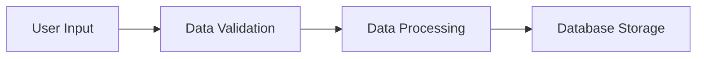
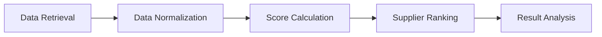

# Data Management and Optimization Documentation

## Database Management (`src/data/database.py`)

### Overview

The Database class manages all data persistence operations using SQLite. It provides methods for storing and retrieving supplier data, optimization results, and application settings.

### Key Features

1. **Database Initialization**

   ```python
   def __init__(self, db_path='suppliers.db'):
       self.db_path = db_path
       self.init_db()
   ```

   - Creates database connection
   - Initializes required tables
   - Sets up database schema

2. **Table Structure**

   ```sql
   CREATE TABLE suppliers (
       id INTEGER PRIMARY KEY AUTOINCREMENT,
       name TEXT NOT NULL,
       cost REAL NOT NULL,
       co2 REAL NOT NULL,
       delivery_time INTEGER NOT NULL,
       ethical_score INTEGER NOT NULL,
       created_at TIMESTAMP DEFAULT CURRENT_TIMESTAMP
   )
   ```

   - Stores supplier information
   - Tracks creation timestamps
   - Maintains data integrity

3. **Data Operations**
   ```python
   def add_supplier(self, supplier_data):
       cursor = self.conn.cursor()
       cursor.execute("""
           INSERT INTO suppliers (name, cost, co2, delivery_time, ethical_score)
           VALUES (?, ?, ?, ?, ?)
       """, (supplier_data['name'], supplier_data['cost'],
             supplier_data['co2'], supplier_data['delivery_time'],
             supplier_data['ethical_score']))
   ```
   - CRUD operations for suppliers
   - Transaction management
   - Error handling

## Data Processing (`src/data/data_processor.py`)

### Overview

The DataProcessor class handles data preprocessing, normalization, and preparation for optimization.

### Key Features

1. **Data Normalization**

   ```python
   def normalize_data(self, df):
       # Normalize numerical columns
       for col in ['cost', 'co2', 'delivery_time']:
           df[f'{col}_normalized'] = (df[col] - df[col].min()) / (df[col].max() - df[col].min())

       # Invert normalized values (lower is better)
       for col in ['cost', 'co2', 'delivery_time']:
           df[f'{col}_normalized'] = 1 - df[f'{col}_normalized']
   ```

   - Min-max normalization
   - Value inversion for cost metrics
   - Ethical score normalization

2. **Data Validation**

   ```python
   def validate_supplier_data(self, data):
       required_fields = ['name', 'cost', 'co2', 'delivery_time', 'ethical_score']
       for field in required_fields:
           if field not in data:
               raise ValueError(f"Missing required field: {field}")
   ```

   - Required field validation
   - Data type checking
   - Range validation

3. **Data Transformation**
   ```python
   def prepare_for_optimization(self, df):
       # Calculate weighted scores
       df['predicted_score'] = (
           df['cost_normalized'] * 0.3 +
           df['co2_normalized'] * 0.25 +
           df['delivery_time_normalized'] * 0.25 +
           df['ethical_score'] / 100 * 0.2
       )
   ```
   - Score calculation
   - Weight application
   - Data preparation

## Optimization Engine (`src/models/optimization_engine.py`)

### Overview

The OptimizationEngine implements the multi-criteria decision-making algorithm for supplier optimization.

### Key Features

1. **Scoring System**

   ```python
   def calculate_supplier_score(self, supplier_data):
       # Normalize values
       cost_score = self.normalize_cost(supplier_data['cost'])
       co2_score = self.normalize_co2(supplier_data['co2'])
       delivery_score = self.normalize_delivery(supplier_data['delivery_time'])
       ethical_score = supplier_data['ethical_score'] / 100

       # Calculate weighted score
       total_score = (
           cost_score * 0.3 +
           co2_score * 0.25 +
           delivery_score * 0.25 +
           ethical_score * 0.2
       )
   ```

   - Multi-criteria scoring
   - Weight application
   - Score normalization

2. **Optimization Process**

   ```python
   def optimize_suppliers(self, suppliers_data):
       # Process each supplier
       scores = []
       for supplier in suppliers_data:
           score = self.calculate_supplier_score(supplier)
           scores.append((supplier, score))

       # Sort by score
       scores.sort(key=lambda x: x[1], reverse=True)
   ```

   - Score calculation
   - Supplier ranking
   - Result generation

3. **Result Analysis**
   ```python
   def analyze_results(self, ranked_suppliers):
       analysis = {
           'top_suppliers': ranked_suppliers[:3],
           'score_distribution': self.calculate_distribution(ranked_suppliers),
           'trade_offs': self.analyze_trade_offs(ranked_suppliers)
       }
   ```
   - Top supplier identification
   - Score distribution analysis
   - Trade-off analysis

## Data Flow

### 1. Data Input



### 2. Optimization Process



### 3. Result Display


## Best Practices

### 1. Data Management

- Use transactions for data integrity
- Implement proper error handling
- Maintain data consistency
- Regular database backups

### 2. Performance Optimization

- Use efficient data structures
- Implement caching where appropriate
- Optimize database queries
- Minimize data transformations

### 3. Data Security

- Validate all inputs
- Sanitize database queries
- Implement access control
- Regular security audits

### 4. Code Quality

- Follow PEP 8 guidelines
- Add comprehensive documentation
- Implement unit tests
- Use type hints

## Error Handling

### 1. Database Errors

```python
try:
    self.conn.execute(query)
except sqlite3.Error as e:
    logger.error(f"Database error: {e}")
    raise DatabaseError(f"Failed to execute query: {e}")
```

### 2. Data Validation Errors

```python
def validate_data(self, data):
    try:
        self.validate_required_fields(data)
        self.validate_data_types(data)
        self.validate_ranges(data)
    except ValidationError as e:
        logger.error(f"Validation error: {e}")
        raise
```

### 3. Optimization Errors

```python
def optimize(self, data):
    try:
        self.validate_input(data)
        results = self.calculate_scores(data)
        return self.rank_suppliers(results)
    except OptimizationError as e:
        logger.error(f"Optimization error: {e}")
        raise
```

## Testing

### 1. Unit Tests

```python
def test_data_normalization():
    processor = DataProcessor()
    test_data = pd.DataFrame({
        'cost': [100, 200, 300],
        'co2': [10, 20, 30]
    })
    normalized = processor.normalize_data(test_data)
    assert normalized['cost_normalized'].max() == 1.0
```

### 2. Integration Tests

```python
def test_optimization_flow():
    db = Database()
    processor = DataProcessor()
    engine = OptimizationEngine()

    # Test complete flow
    data = load_test_data()
    db.add_suppliers(data)
    processed = processor.prepare_for_optimization(data)
    results = engine.optimize_suppliers(processed)

    assert len(results) > 0
```

### 3. Performance Tests

```python
def test_performance():
    # Test with large dataset
    data = generate_large_dataset()
    start_time = time.time()
    results = optimize_suppliers(data)
    duration = time.time() - start_time

    assert duration < 1.0  # Should complete within 1 second
```
